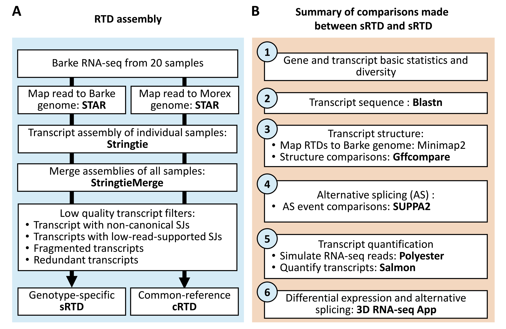

Table of contents
-----------------

-   [Genotype-specific RTD study pipeline](#pipeline)
-   [sRTD and cRTD assembly](#assembly)
-   [RNA-seq read mapping](#mapping)
-   [Transcript assembly](#trans_assembly)
-   [Comparisons of sRTD and cRTD](#comparison)
-   [Alternative splicing event analysis using Suppa](#as_events)
-   [Transcript comparisons](#trans_comparisons)
-   [Quantification comparisons](#quant_comparisons)
-   [References](#references)

<div align="justify">

## Genotype-specific RTD study pipeline

<center></center>

## sRTD and cRTD assembly

### Data pre-processing

#### Raw RNA-seq read trimming
The adapters of the raw RNA-seq reads were trimmed using Trimmomatic v0.39 (Bolger et al. 2014) with quality control by using FastQC v0.11.9 (http://www.bioinformatics.babraham.ac.uk/projects/fastqc/). The parameter settings of Trimmomatic:

  - Maximum mismatch count which will still allow a full match to be performed: seedMismatches = 2.
  - How accurate the match between the two ‘adapter ligated’ reads must be for PE palindrome read alignment: palindromeClipThreshold = 30.
  - How accurate the match between any adapter etc. sequence must be against a read: simpleClipThreshold = 7.
  - Remove low-quality bases from the beginning: LEADING = 20.
  - Remove low-quality bases from the end: TRAILING = 20.
  - Drop the read if it is below a specified length: MINLEN = 20.


```shell
# Trimmomatic version 0.39 
trimmomatic PE $input_1 $input_2 $output_1P $output_1U $output_2P $output_2U ILLUMINACLIP:adapters.fasta:2:30:7 LEADING:20 TRAILING:20 MINLEN:20
```

#### Fastqc read quality report

```shell
fastqc $fastq_file -o $report_dir
```

### RNA-seq read mapping

The trimmed RNA-seq reads of 20 samples were mapped the Barke and Morex reference genomes by using STAR v2.7.3a (Dobin et al. 2013). Settings of key parameters: 

  - Minimum intron size: alignIntronMin = 60.  
  - Maximum intron size: alignIntronMax = 6000. 
  - Permitted mapping mismatches: outFilterMismatchNmax = 2 in pass1 and = 0 in pass2. 
  - The details of the other parameters can be found in:
  
  https://github.com/alexdobin/STAR/blob/master/doc/STARmanual.pdf 

  

#### STAR mapping index

```shell
### index star mapping pass1
STAR \
--runMode genomeGenerate \
--genomeDir $output_dir \
--genomeFastaFiles $genome_fasta \
--outFileNamePrefix $output_dir \
--limitGenomeGenerateRAM 240000000000

### merge sj files from star mapping pass1
cat star_result_pass1/*/SJ.out.tab | awk '($5 > 0 && $7 > 2 && $6==0)' | cut -f1-6 | sort | uniq > $sj_file

### index star mapping pass2
STAR \
--runMode genomeGenerate \
--genomeDir $output_dir \
--genomeFastaFiles $genome_fasta \
--outFileNamePrefix $output_dir \
--limitGenomeGenerateRAM 240000000000 \
--sjdbFileChrStartEnd $sj_file

```

#### STAR mapping

```shell
### mapping scripts for pass1 and pass2
STAR \
--genomeDir $Index_dir \
--readFilesIn $read1 $read1 \
--sjdbOverhang 100 \
--alignIntronMin 60 \
--alignIntronMax 15000 \
--alignMatesGapMax 2000 \
--alignEndsType Local \
--alignSoftClipAtReferenceEnds Yes \
--outSAMprimaryFlag AllBestScore \
--outFilterType BySJout \
--outFilterMismatchNmax 0 \
--outFilterMismatchNoverLmax 0.3 \
--outFilterScoreMinOverLread 0.66 \
--outFilterMatchNmin 0 \
--outFilterScoreMin 0 \
--outFilterMultimapNmax 15 \
--outFilterIntronMotifs RemoveNoncanonical \
--outFilterIntronStrands RemoveInconsistentStrands \
--outSJfilterReads All \
--outSJfilterCountUniqueMin -1 5 5 5 \
--outSJfilterCountTotalMin -1 5 5 5 \
--outSAMstrandField intronMotif \
--outSAMtype BAM SortedByCoordinate \
--alignTranscriptsPerReadNmax 30000 \
--twopassMode None \
--readFilesCommand zcat \
--outReadsUnmapped Fastx \
--outFileNamePrefix $outfolder \
--outTmpDir $outTmpDir \
--alignSJoverhangMin 5 \
--alignSJDBoverhangMin 3 \
--outSJfilterOverhangMin -1 12 12 12 \
--outFilterMatchNminOverLread 0.66 \
--outFilterMismatchNoverReadLmax 1 \
--alignSJstitchMismatchNmax 0 0 0 0

```

### Transcript assembly

Stringtie was used to assemble transcripts from the read alignment in each sample and Stringtie-merge was used to merge the transcripts in all the samples (Pertea et al. 2015). Settings of key parameters:

  - library type: stranded library fr-firststrand (--rf)
  - Minimum intron size: -g = 50
  - The details of the other parameters can be found in: http://ccb.jhu.edu/software/stringtie/index.shtml?t=manual. 


#### Stringtie

```shell
stringtie $bam_file \
-o ${save_dir}trans.gtf \
--rf \
-A gene_abund.tab \
-a 5 \
-j 0.1 \
-f 0.3 \
-g 50 \
-M 1 \
-c 2.5
```

#### StringtieMerge
```shell
stringtie --merge \
-o $outGtf \
-p $NSLOTS \
-F 0 \
-T 0 \
-f 0 \
-l $preFix \
-i $gtfList
```

#### RTD QC and misassembly filters

The low-quality transcripts were filtered: 

  - Filter unstrand transcripts
  - Filter transcripts with non-canonical splice junctions
  - Filter transcripts with low read support splice junctions. A splice junction must be supported by at least 3 reads in at least 2 samples. 
  - Filter redundant transcripts. If the transcripts in the same gene have identical structures, the shorter one was filtered. 
  - Filter transcript fragments were filtered if their length was < 70% of the gene length.


```r

# gtf: gtf file of assemnled RTD
# output_dir output directory to save results
# uniqueMap: uniquely mapped reads to support a SJ
# nSamples: number of samples to suppor the SJ
# fragmetn: fragmented transcript percent
if(!file.exists(output_dir))
  dir.create(output_dir,recursive = T)

if('type' %in% colnames(mcols(gtf))) {
  exons <- gtf[gtf$type=='exon',]
} else if('feature' %in% colnames(mcols(gtf))){
  exons <- gtf[gtf$type=='feature',]
} else {
  stop('There is no exon feature in the gtf')
}

tx2gene <- DataFrame(seqnames=as.vector(seqnames(exons)),
                     transcript_id=exons$transcript_id,gene_id=exons$gene_id)
tx2gene <- tx2gene[!duplicated(tx2gene),]
rownames(tx2gene) <- tx2gene$transcript_id
# head(tx2gene)

#########################################################################################
###---> filter unstrand transcripts
message('Filter unstrand transcripts')
gr <- split(exons,exons$transcript_id)
s <- unlist(runValue(strand(gr)))
trans_unstrand <- names(s)[s=='*']
exons <- exons[!(exons$transcript_id %in% trans_unstrand),]
gtf_unstrand <- gtf[gtf$transcript_id %in% trans_unstrand,]
gtf_unstrand <- sort(gtf_unstrand,by=~seqnames + start + end)
if(NROW(gtf_unstrand)==0){
  file.create(file.path(output_dir,'unstrand.gtf'),recursive=T)
} else {
  rtracklayer::export(gtf_unstrand,
                      con = file.path(output_dir,'unstrand.gtf'))
}

#########################################################################################
###---> filter non-canonical splice junctions
message('Filter transcripts with non-canonical splice junctions')
canonical_sj <- lapply(sj, function(x) x$ids)
canonical_sj <- Reduce(f = union,canonical_sj)
introns <- exon2intron(exons,add_label = T)
trans_non_canonical <- unique(introns$transcript_id[!(introns$label %in% canonical_sj)])
gtf_non_canonical <- gtf[gtf$transcript_id %in% trans_non_canonical,]
gtf_non_canonical <- sort(gtf_non_canonical,by=~seqnames + start + end)
if(NROW(gtf_non_canonical)==0){
  file.create(file.path(output_dir,'non_canonical_sj.gtf'),recursive=T)
} else {
  rtracklayer::export(gtf_non_canonical,
                      con = file.path(output_dir,'non_canonical_sj.gtf'))
}
exons <- exons[!(exons$transcript_id %in% trans_non_canonical),]
introns <- introns[!(introns$transcript_id %in% trans_non_canonical),]

#########################################################################################
###---> Filter transcripts with low read support splice junctions
message('Filter transcripts with low read support splice junctions')
sj_lq <- sjQC(sj = sj,uniqueMap = uniqueMap,nSamples = nSamples)$SJ_LQ
trans_low_support <- unique(introns$transcript_id[introns$label %in% sj_lq])

gtf_low_support  <- gtf[gtf$transcript_id %in% trans_low_support,]
gtf_low_support <- sort(gtf_low_support,by=~seqnames + start + end)
if(NROW(gtf_low_support)==0){
  file.create(file.path(output_dir,'low_read_support_sj.gtf'),recursive=T)
} else {
  rtracklayer::export(gtf_low_support,
                      con = file.path(output_dir,'low_read_support_sj.gtf'))
}
exons <- exons[!(exons$transcript_id %in% trans_low_support),]
introns <- introns[!(introns$transcript_id %in% trans_low_support),]

#########################################################################################
###---> Filter redundant transcripts
message('Filter redundant transcripts')
## extract introns
trans <- unique(exons$transcript_id)
multi_trans <- unique(introns$transcript_id)
mono_trans <- setdiff(trans,multi_trans)

## mono exon
gr <- exons[exons$transcript_id %in% mono_trans,]
gr_list <- split(gr,gr$gene_id)
idx <- width(gr_list)==max(width(gr_list))
exon_mono <- unlist(gr_list[idx])


## multi exon
chain <- intronChain(introns = introns)
gr <- exons[exons$transcript_id %in% multi_trans,]
gr_list <- split(gr,gr$transcript_id)
gr_range <-  unlist(range(gr_list))
gr_range$transcript_id <- names(gr_range)
gr_range$gene_id <- tx2gene[gr_range$transcript_id,'gene_id']
gr_range$intron_chain <- chain[gr_range$transcript_id]
gr_range_list <- split(gr_range,gr_range$intron_chain)
gr_range_list <- gr_range_list[width(gr_range_list)==max(width(gr_range_list))]
gr_range <- unlist(gr_range_list,use.names = F)
trans2keep <- unique(gr_range$transcript_id)
exon_multi <- unlist(gr_list[trans2keep,])

exons <- c(exon_mono,exon_multi)
exons <- sort(exons, by = ~ seqnames + start + end)

trans_redundant <- setdiff(trans,unique(exons$transcript_id))
gtf_redundant <- gtf[gtf$transcript_id %in% trans_redundant,]
gtf_redundant <- sort(gtf_redundant,by=~seqnames + start + end)

if(NROW(gtf_redundant)==0){
  file.create(file.path(output_dir,'redundant.gtf'),recursive=T)
} else {
  rtracklayer::export(gtf_redundant,
                      con = file.path(output_dir,'redundant.gtf'))
}

#########################################################################################
###---> Filter fragment transcripts
message('Filter fragment transcripts')
trans_width <- range(split(exons,exons$transcript_id))
trans_width <- unlist(width(trans_width))
genes_width <- range(split(exons,exons$gene_id))
genes_width <- unlist(width(genes_width))
tx2gene$trans_width <- trans_width[tx2gene$transcript_id]
tx2gene$genes_width <- genes_width[tx2gene$gene_id]
trans_fragment <- unique(tx2gene$transcript_id[tx2gene$trans_width < fragment*tx2gene$genes_width])

gtf_fragment <- gtf[gtf$transcript_id %in% trans_fragment,]
gtf_fragment <- sort(gtf_fragment,by=~seqnames + start + end)

if(NROW(gtf_fragment)==0){
  file.create(file.path(output_dir,'fragment.gtf'),recursive=T)
} else {
  rtracklayer::export(gtf_fragment,
                      con = file.path(output_dir,'fragment.gtf'))
}

exons <- exons[!(exons$transcript_id %in% trans_fragment),]
exons <- sort(exons, by = ~ seqnames + start + end)

if(NROW(exons)==0){
  file.create(file.path(output_dir,'final.gtf'),recursive=T)
} else {
  rtracklayer::export(exons,file.path(output_dir,'final.gtf'))
}


result <- list(final=exons,
               unstrand=gtf_unstrand,
               non_canonical=gtf_non_canonical,
               low_read_support=gtf_low_support,
               redundant=gtf_redundant,
               fragment=gtf_fragment)

stat <- lapply(result, function(x){
  data.frame(
    gene=length(unique(x$gene_id)),
    transcript=length(unique(x$transcript_id))
  )
})
stat <- do.call(rbind,stat)
write.csv(stat,file.path(output_dir,'stat.csv'))

```

## Comparisons of sRTD and cRTD

### Transcript translation using Transuite

Transuite was used to translate the transcript sequences into proteins with default parameters (Entizne et al. 2020). Details of parameter settings can be found in: https://github.com/anonconda/TranSuitet.

```shell
python transuite.py Auto \
--gtf $gtf \
--fasta $fasta \
--outpath $outpath \
--outname $outname \
--cds 30 \
--iter 5 \
--pep 100 \
--ptc 70
```

### Protein blastp agaist UniProtKB

Blastp (https://www.ncbi.nlm.nih.gov/books/NBK279690/) was used to compare the protein sequences of the transcripts to the Plant Protein Annotation in the UniProtKB databases (Schneider et al. 2009). Settings of key parameters:
  
  - Number of aligned sequences to keep: max_target_seqs = 1. 
  - Maximum number of HSPs (alignments) to keep for any single query-subject pair: max_hsps = 1.
  - Expect value (E) for saving hits: evalue = 0.01.

```shell
blastp \
-query $query_fasta \
-db $subject_fasta \
-out $output_file \
-max_target_seqs 1 \
-max_hsps 1 \
-evalue 0.01 \
-outfmt "6 qseqid sseqid nident pident length ' \
              'mismatch gapopen gaps qstart qend sstart send qlen slen evalue bitscore sstrand"
```

### Transcript quantification using Salmon

Salmon (https://salmon.readthedocs.io/en/latest/) was used to generate transcript level read counts and transcript per million reads (TPMs) with trimmed reads and the assembled RTD as inputs (Patro et al. 2017).

#### Salmon index
```shell
salmon index -t ${fasta_file} -i ${index_dir} -p ${thread} -k 31 --keepDuplicates
```

#### Salmon Quantification
```shell
salmon quant \
-i $index_dir \
-l A \
-1 $read1 \
-2 $read2 \
-p $thread \
-o $output_folder \
--seqBias \
--posBias \
--gcBias \
--validateMappings
```

### Alternative splicing event analysis using Suppa

SUPPA2 (https://github.com/comprna/SUPPA) was used to generate alternative splicing events (Trincado et al. 2018).

```shell
case "$format" in
"ioe")
echo Suppa: local events $format

suppa.py generateEvents \
-i $gtf_file \
-o $output_dir \
-f $format \
-e SE SS MX RI FL

;;

"ioi")
echo Suppa: transcript events $format

suppa.py generateEvents \
-i $gtf_file \
-o $output_dir \
-f $format

esac
```

### Transcript comparisons

The transcript sequences between cRTD and sRTD were compared with Blastn (https://www.ncbi.nlm.nih.gov/books/NBK279690/). The transcripts of cRTD and sRTD were also mapped to Barke reference genome with Minimpa2 (Li 2018) for structure comparisons with Gffcompare (https://ccb.jhu.edu/software/stringtie/gffcompare.shtml) (Pertea and Pertea 2020).

#### Sequence comparison using blastn

Settings of key parameters:

  - Number of aligned sequences to keep: max_target_seqs = 1. 
  - Maximum number of HSPs (alignments) to keep for any single query-subject pair: max_hsps = 1.
  - Expect value (E) for saving hits: evalue = 0.01.

```shell
blastn \
-query $query_fasta \
-subject $subject_fasta \
-out $output_dir \
-max_target_seqs 1 \
-max_hsps 1 \
-evalue 0.01 \
-outfmt "6 qseqid sseqid nident pident length ' \
              'mismatch gapopen gaps qstart qend sstart send qlen slen evalue bitscore sstrand"

```

#### Map transcript sequence to genome using Minimap2

Settings of key parameters:

  - Maximum intron size: G = 1500

```shell
minimap2 \
-G 15000 \
-L \
--secondary=no \
--split-prefix $prefix \
-ax splice:hq -uf $genome_fasta $trans_fasta > $output_sam
```

#### Structure comparison using Gffcompare
```shell
gffcompare \
-r $target_gtf $query_gtf -o ${output_dir} -C -X -V --debug 2>log.txt
```

## Quantification comparisons
### RNA-seq read simulation

The polyester R package (https://bioconductor.org/packages/release/bioc/html/polyester.html) (Frazee et al. 2015) was used to generate simulated 150bp stranded paired-end RNA-seq reads for RTD evaluation. The simulation was based on a transcript level read count matrix generated from the quantifications of a study of Barke caryopsis and root tissues (each with 3 biological reps).

```shell
library(polyester)
library(Biostrings)
readlen <- 150
strand_specific <- T
paired <- T

simulate_experiment_countmatv2(fasta = fasta_file,
                               readmat=countmat,
                               outdir=outdir,
                               paired = paired,
                               readlen=readlen,
                               strand_specific=strand_specific,
                               error_model='illumina5')
                               
```

### Differential expression analysis

The analyses of differentially expressed genes (DE genes), differentially alternative spliced genes (DAS genes), differentially expressed transcripts (DE transcripts) and differential transcript usage transcripts (DTU transcripts) were performed with 3D RNA-seq App (https://github.com/wyguo/ThreeDRNAseq) (Guo et al. 2020). The significance was determined with a Benjamini-Hochberg (BH) adjusted p-value < 0.01 and absolute log2-fold-change >= 1 for DE genes and transcripts and BH adjusted p-value < 0.01 and absolute Delta present spliced (Delta PS) >= 10% for the DAS genes and DTU transcripts.

<a style="float:center" href="https://youtu.be/rqeXECX1-T4" target="_blank">
  
</a>

## References

Bolger AM, Lohse M, Usadel B. 2014. Trimmomatic: A flexible trimmer for Illumina sequence data. Bioinformatics 30: 2114–2120.

Dobin A, Davis CA, Schlesinger F, Drenkow J, Zaleski C, Jha S, Batut P, Chaisson M, Gingeras TR. 2013. STAR: Ultrafast universal RNA-seq aligner. Bioinformatics 29: 15–21.

Entizne JC, Guo W, Calixto CP, Spensley M, Tzioutziou N, Zhang R, Brown JW. 2020. TranSuite: a software suite for accurate translation and characterization of transcripts. bioRxiv 2020.12.15.422989. doi:10.1101/2020.12.15.422989.

Frazee AC, Jaffe AE, Langmead B, Leek JT. 2015. Polyester: Simulating RNA-seq datasets with differential transcript expression. Bioinformatics 31: 2778–2784. doi:10.1093/bioinformatics/btv272.

Guo W, Tzioutziou NA, Stephen G, Milne I, Calixto CPG, Waugh R, Brown JWS, Zhang R. 2020. 3D RNA-seq: a powerful and flexible tool for rapid and accurate differential expression and alternative splicing analysis of RNA-seq data for biologists. RNA Biol 00: 1–14. doi:10.1080/15476286.2020.1858253.

Li H. 2018. Minimap2: pairwise alignment for nucleotide sequences ed. I. Birol. Bioinformatics 34: 3094–3100. doi:10.1093/bioinformatics/bty191.

Patro R, Duggal G, Love MI, Irizarry RA, Kingsford C. 2017. Salmon provides fast and bias-aware quantification of transcript expression. Nat Methods 14: 417–419. doi:10.1038/nmeth.4197.
Pertea M, Pertea G. 2020. GFF Utilities: GffRead and GffCompare. F1000Research 9: 304. doi:10.12688/f1000research.23297.1.

Pertea M, Pertea GM, Antonescu CM, Chang T-C, Mendell JT, Salzberg SL. 2015. StringTie enables improved reconstruction of a transcriptome from RNA-seq reads. Nat Biotechnol 33: 290–295. doi:10.1038/nbt.3122.

Schneider M, Lane L, Boutet E, Lieberherr D, Tognolli M, Bougueleret L, Bairoch A. 2009. The UniProtKB/Swiss-Prot knowledgebase and its Plant Proteome Annotation Program. J Proteomics 72: 567–573. doi:10.1016/j.jprot.2008.11.010.

Trincado JL, Entizne JC, Hysenaj G, Singh B, Skalic M, Elliott DJ, Eyras E. 2018. SUPPA2: Fast, accurate, and uncertainty-aware differential splicing analysis across multiple conditions. Genome Biol 19: 40. doi:10.1186/s13059-018-1417-1.


